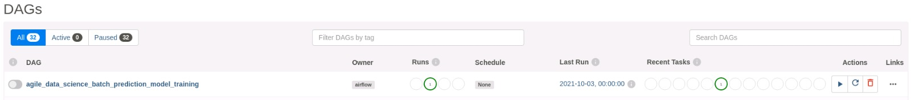

# Agile_Data_Code_2

Code for [Agile Data Science 2.0](http://shop.oreilly.com/product/0636920051619.do), O'Reilly 2017. Now available at the [O'Reilly Store](http://shop.oreilly.com/product/0636920051619.do), on [Amazon](https://www.amazon.com/Agile-Data-Science-2-0-Applications/dp/1491960116) (in Paperback and Kindle) and on [O'Reilly Safari](https://www.safaribooksonline.com/library/view/agile-data-science/9781491960103/). Also available anywhere technical books are sold!

This is also the code for the [Realtime Predictive Analytics](http://datasyndrome.com/video) video course and [Introduction to PySpark](http://datasyndrome.com/training) live course!

Have problems? Please file an issue!


## Realtime Predictive Analytics Course

There is now a video course using code from chapter 8, [Realtime Predictive Analytics with Kafka, PySpark, Spark MLlib and Spark Streaming](http://datasyndrome.com/video). Check it out now at [datasyndrome.com/video](http://datasyndrome.com/video).

A free preview of the course is available at [https://vimeo.com/202336113](https://vimeo.com/202336113)

[](http://datasyndrome.com/video)

# The Data Value Pyramid

Originally by Pete Warden, the data value pyramid is how the book is organized and structured. We climb it as we go forward each chapter.


# System Architecture

The following diagrams are pulled from the book, and express the basic concepts in the system architecture. The front and back end architectures work together to make a complete predictive system.

## Front End Architecture

This diagram shows how the front end architecture works in our flight delay prediction application. The user fills out a form with some basic information in a form on a web page, which is submitted to the server. The server fills out some neccesary fields derived from those in the form like "day of year" and emits a Kafka message containing a prediction request. Spark Streaming is listening on a Kafka queue for these requests, and makes the prediction, storing the result in MongoDB. Meanwhile, the client has received a UUID in the form's response, and has been polling another endpoint every second. Once the data is available in Mongo, the client's next request picks it up. Finally, the client displays the result of the prediction to the user! 

This setup is extremely fun to setup, operate and watch. Check out chapters 7 and 8 for more information!


## Back End Architecture

The back end architecture diagram shows how we train a classifier model using historical data (all flights from 2015) on disk (HDFS or Amazon S3, etc.) to predict flight delays in batch in Spark. We save the model to disk when it is ready. Next, we launch Zookeeper and a Kafka queue. We use Spark Streaming to load the classifier model, and then listen for prediction requests in a Kafka queue. When a prediction request arrives, Spark Streaming makes the prediction, storing the result in MongoDB where the web application can pick it up.

This architecture is extremely powerful, and it is a huge benefit that we get to use the same code in batch and in realtime with PySpark Streaming.


# Screenshots

Below are some examples of parts of the application we build in this book and in this repo. Check out the book for more!

## Airline Entity Page

Each airline gets its own entity page, complete with a summary of its fleet and a description pulled from Wikipedia.


## Airplane Fleet Page

We demonstrate summarizing an entity with an airplane fleet page which describes the entire fleet.


## Flight Delay Prediction UI

We create an entire realtime predictive system with a web front-end to submit prediction requests.


## Downloading Data

Once the server comes up, download the data and you are ready to go. First change directory into the `practica_big_data_2019` directory.

```
cd practica_big_data_2019
```
Now download the data.

For the [Realtime Predictive Analytics](http://datasyndrome.com/video)  run: 

```
resources/download_data.sh
```
## Installation

You need to install each component included in the architecture. 
The following list includes some links with the installation procedure for each component:

 - [Intellij](https://www.jetbrains.com/help/idea/installation-guide.html) (jdk_1.8)
 - [Pyhton3](https://realpython.com/installing-python/) (Suggested version 3.7) 
 - [PIP](https://pip.pypa.io/en/stable/installing/)
 - [SBT](https://www.scala-sbt.org/release/docs/Setup.html) 
 - [MongoDB](https://docs.mongodb.com/manual/installation/)
 - [Spark](https://spark.apache.org/docs/latest/) (Mandatory version 3.1.2)
 - [Scala](https://www.scala-lang.org)(Suggested version 2.12)
 - [Zookeeper](https://zookeeper.apache.org/releases.html)
 - [Kafka](https://kafka.apache.org/quickstart) (Mandatory version kafka_2.12-3.0.0)
 
 ### Install python libraries
 
 ```
  pip install -r requirements.txt
 ```
 ### Start Zookeeper
 
 Open a console and go to the downloaded Kafka directory and run:
 
 ```
   bin/zookeeper-server-start.sh config/zookeeper.properties
  ```
  ### Start Kafka
  
  Open a console and go to the downloaded Kafka directory and run:
  
  ```
    bin/kafka-server-start.sh config/server.properties
   ```
   open a new console in teh same directory and create a new topic :
  ```
      bin/kafka-topics.sh \
        --create \
        --bootstrap-server localhost:9092 \
        --replication-factor 1 \
        --partitions 1 \
        --topic flight_delay_classification_request
   ```
   You should see the following message:
  ```
    Created topic "flight_delay_classification_request".
  ```
  You can see the topic we created with the list topics command:
  ```
      bin/kafka-topics.sh --bootstrap-server localhost:9092 --list
  ```
  Output:
  ```
    flight_delay_classification_request
  ```
  (Optional) You can oen a new console with a consumer in order to see the messeges sent to that topic
  ```
  bin/kafka-console-consumer.sh \
      --bootstrap-server localhost:9092 \
      --topic flight_delay_classification_request \
      --from-beginning
  ```
  ## Import the distance records to MongoDB
  Check if you have Mongo up and running:
  ```
  service mongod status
  ```
  Output:
  ```
  mongod.service - MongoDB Database Server
     Loaded: loaded (/lib/systemd/system/mongod.service; disabled; vendor preset: 
     Active: active (running) since Tue 2019-10-01 14:58:53 CEST; 2h 11min ago
       Docs: https://docs.mongodb.org/manual
   Main PID: 7816 (mongod)
     CGroup: /system.slice/mongod.service
             └─7816 /usr/bin/mongod --config /etc/mongod.conf
  
  oct 01 14:58:53 amunoz systemd[1]: Started MongoDB Database Server.
  ```
  Run the import_distances.sh script
  ```
  ./resources/import_distances.sh
  ```
  Output:
  ```
  2019-10-01T17:06:46.957+0200	connected to: mongodb://localhost/
  2019-10-01T17:06:47.035+0200	4696 document(s) imported successfully. 0 document(s) failed to import.
  MongoDB shell version v4.2.0
  connecting to: mongodb://127.0.0.1:27017/agile_data_science?compressors=disabled&gssapiServiceName=mongodb
  Implicit session: session { "id" : UUID("9bda4bb6-5727-4e91-8855-71db2b818232") }
  MongoDB server version: 4.2.0
  {
  	"createdCollectionAutomatically" : false,
  	"numIndexesBefore" : 1,
  	"numIndexesAfter" : 2,
  	"ok" : 1
  }

  ```
  ## Train and Save de the model with PySpark mllib
  In a console go to the base directory of the cloned repo, then go to the `practica_big_data_2019` directory
  ```
    cd practica_big_data_2019
  ```
  Set the `JAVA_HOME` env variable with teh path of java installation directory, for example:
  ```
    export JAVA_HOME=/usr/lib/jvm/java-1.8.0-openjdk-amd64
  ```
  Set the `SPARK_HOME` env variable with teh path of your Spark installation folder, for example:
  ```
    export SPARK_HOME=/opt/spark
  ```
  Now, execute the script `train_spark_mllib_model.py`
  ```
      python3 resources/train_spark_mllib_model.py .
  ```
  As result, some files will be saved in the `models` folder 
  
  ```
  ls ../models
  
  ```   
  ## Run Flight Predictor
  First, you need to change the base_paht val in the MakePrediction scala class,
  change that val for the path where you clone repo is placed:
  ```
    val base_path= "/home/user/Desktop/practica_big_data_2019"
    
  ``` 
  Then run the code using Intellij or spark-submit with their respective arguments. 
  
Please, note that in order to use spark-submit you first need to compile the code and build a JAR file using sbt. Also, when running the spark-submit command, you have to add at least these two packages with the --packages option:
  ```
  --packages org.mongodb.spark:mongo-spark-connector_2.12:3.0.1,org.apache.spark:spark-sql-kafka-0-10_2.12:3.1.2
     
  ``` 
   Be carefull with the packages version because if you are using another version of spark, kafka or mongo you have to choose the correspondent version to your installation. This packages work with Spark 3.1.2, kafka_2.12-3.1.2 and mongo superior to 2.6
  
  ## Start the prediction request Web Application
  
  Set the `PROJECT_HOME` env variable with teh path of you cloned repository, for example:
   ```
  export PROJECT_HOME=/home/user/Desktop/practica_big_data_2019
   ```
  Go to the `web` directory under `resources` and execute the flask web application file `predict_flask.py`:
  ```
  cd practica_big_data_2019/resources/web
  python3 predict_flask.py
  
  ```
  Now, visit http://localhost:5000/flights/delays/predict_kafka and, for fun, open the JavaScript console. Enter a nonzero departure delay, an ISO-formatted date (I used 2016-12-25, which was in the future at the time I was writing this), a valid carrier code (use AA or DL if you don’t know one), an origin and destination (my favorite is ATL → SFO), and a valid flight number (e.g., 1519), and hit Submit. Watch the debug output in the JavaScript console as the client polls for data from the response endpoint at /flights/delays/predict/classify_realtime/response/.
  
  Quickly switch windows to your Spark console. Within 10 seconds, the length we’ve configured of a minibatch, you should see something like the following:
  
  ## Check the predictions records inserted in MongoDB
  ```
   $ mongo
   > use use agile_data_science;
   >db.flight_delay_classification_response.find();
  
  ```
  You must have a similar output as:
  
  ```
  { "_id" : ObjectId("5d8dcb105e8b5622696d6f2e"), "Origin" : "ATL", "DayOfWeek" : 6, "DayOfYear" : 360, "DayOfMonth" : 25, "Dest" : "SFO", "DepDelay" : 290, "Timestamp" : ISODate("2019-09-27T08:40:48.175Z"), "FlightDate" : ISODate("2016-12-24T23:00:00Z"), "Carrier" : "AA", "UUID" : "8e90da7e-63f5-45f9-8f3d-7d948120e5a2", "Distance" : 2139, "Route" : "ATL-SFO", "Prediction" : 3 }
  { "_id" : ObjectId("5d8dcba85e8b562d1d0f9cb8"), "Origin" : "ATL", "DayOfWeek" : 6, "DayOfYear" : 360, "DayOfMonth" : 25, "Dest" : "SFO", "DepDelay" : 291, "Timestamp" : ISODate("2019-09-27T08:43:20.222Z"), "FlightDate" : ISODate("2016-12-24T23:00:00Z"), "Carrier" : "AA", "UUID" : "d3e44ea5-d42c-4874-b5f7-e8a62b006176", "Distance" : 2139, "Route" : "ATL-SFO", "Prediction" : 3 }
  { "_id" : ObjectId("5d8dcbe05e8b562d1d0f9cba"), "Origin" : "ATL", "DayOfWeek" : 6, "DayOfYear" : 360, "DayOfMonth" : 25, "Dest" : "SFO", "DepDelay" : 5, "Timestamp" : ISODate("2019-09-27T08:44:16.432Z"), "FlightDate" : ISODate("2016-12-24T23:00:00Z"), "Carrier" : "AA", "UUID" : "a153dfb1-172d-4232-819c-8f3687af8600", "Distance" : 2139, "Route" : "ATL-SFO", "Prediction" : 1 }


```

### Train the model with Apache Airflow (optional)

- The version of Apache Airflow used is the 2.1.4 and it is installed with pip. For development it uses SQLite as database but it is not recommended for production. For the laboratory SQLite is sufficient.

- Install python libraries for Apache Airflow (suggested Python 3.7)

```shell
cd resources/airflow
pip install -r requirements.txt -c constraints.txt
```
- Set the `PROJECT_HOME` env variable with the path of you cloned repository, for example:
```
export PROJECT_HOME=/home/user/Desktop/practica_big_data_2019
```
- Configure airflow environment

```shell
export AIRFLOW_HOME=~/airflow
mkdir $AIRFLOW_HOME/dags
mkdir $AIRFLOW_HOME/logs
mkdir $AIRFLOW_HOME/plugins

airflow users create \
    --username admin \
    --firstname Jack \
    --lastname  Sparrow\
    --role Admin \
    --email example@mail.org
```
- Start airflow scheduler and webserver
```shell
airflow webserver --port 8080
airflow sheduler
```
Vistit http://localhost:8080/home for the web version of Apache Airflow.

- The DAG is defined in `resources/airflow/setup.py`.
- **TODO**: add the DAG and execute it to train the model (see the official documentation of Apache Airflow to learn how to exectue and add a DAG with the airflow command).
- **TODO**: explain the architecture of apache airflow (see the official documentation of Apache Airflow).
- **TODO**: analyzing the setup.py: what happens if the task fails?, what is the peridocity of the task?




